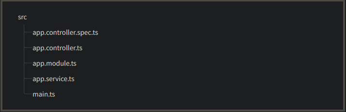

```bash
$ npm i -g @nestjs/cli
$ nest new project-name
```

où :

```bash
$ git clone https://github.com/Ossama-Saidi/ehei-connect.git
$ cd project
$ pnpm install
$ pnpm run start
```

navigate to [`http://localhost:3000/`](http://localhost:3000/)

    

Here's a brief overview of those core files:

| app.controller.ts      | A basic controller with a single route.                                                                           |
| ---------------------- | ----------------------------------------------------------------------------------------------------------------- |
| app.controller.spec.ts | The unit tests for the controller.                                                                                |
| app.module.ts          | The root module of the application.                                                                               |
| app.service.ts         | A basic service with a single method.                                                                             |
| main.ts                | The entry file of the application which uses the core function NestFactory to create a Nest application instance. |

---

---

## GitFlow

main
│
├── develop
│   ├── feature/auth-service
│   │   ├── feature/auth-login
│   │   ├── feature/auth-register
│   │   └── ...
│   │
│   ├── feature/payment-service
│   │   ├── feature/payment-stripe
│   │   ├── feature/payment-paypal
│   │   └── ...
│   │
│   ├── feature/notification-service
│   │   ├── feature/email-notifications
│   │   ├── feature/sms-notifications
│   │   └── ...

### 🔥 **Bonnes pratiques GitFlow pour microservices**

✅ **Pull requests (PR)** : Toujours ouvrir une PR pour fusionner une branche (ex : `feature/auth-service -> develop`).
✅ **Revue de code** : Les autres membres de l’équipe doivent valider la PR avant le merge.
✅ **Tests CI/CD** : Intégrer des tests automatiques avant d’autoriser un merge.
✅ **Petites branches** : Ne pas accumuler trop de changements dans une seule branche, pour éviter les conflits complexes.

---